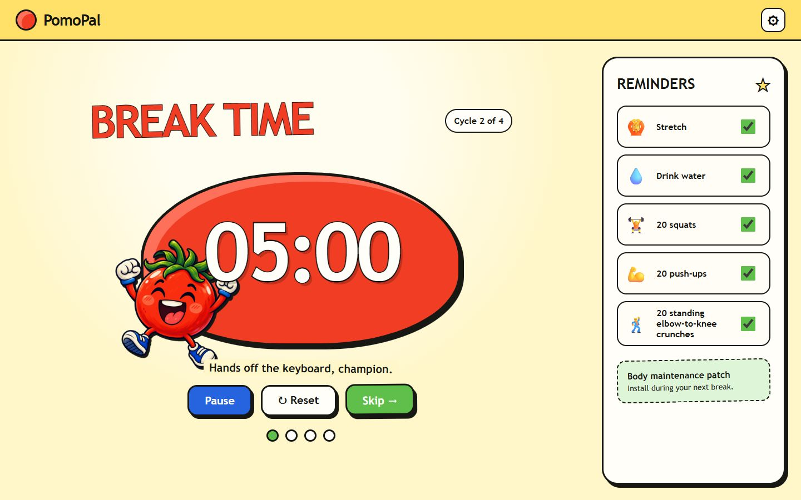

# PomoPal

A playful, open-source automatic Pomodoro timer for Windows. PomoPal alternates personalized focus and break sessions, rings in a maximized window, and reminds you to stretch, hydrate, squat, do push-ups, and complete standing elbow-to-knee crunches.



## Features

- Personalized focus, short-break and long-break durations
- Automatic focus/break cycles and Windows startup
- Sound and volume controls
- Full-window break reminders with a cartoon mascot
- Configurable movement and hydration checklist

## Install

For the simplest start, run the portable `dist/PomoPal 1.0.1.exe`. It needs no installation. Alternatively, run `dist/PomoPal Setup 1.0.1.exe` to install it. The default settings start a 25-minute focus timer immediately and register PomoPal to open when you sign in to Windows.

Use the gear button to personalize focus, short-break and long-break durations, cycles, automatic starts, Windows startup, sound, volume, and reminders.

## Develop

```powershell
npm install
npm test
npm start
```

Build the Windows installer with `npm run dist`.

## License

MIT © 2026 PomoPal contributors
